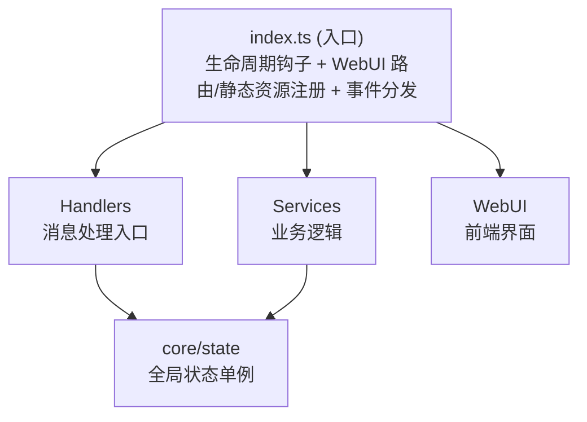

# 云枫（napcat-plugin-yunfeng）

NapCat 插件：群授权 / 开机门禁为基础，Webhook 通知推群可跑通，后续功能按同一门禁扩展。

## 核心约定

1. **群授权**：每群有 `authExpireAt`（到期时间），可在 WebUI「延长 / 设为」天数
2. **开机状态**：每群独立开机 / 关机
3. **门禁**：仅当「全局启用 + 已授权且未过期 + 已开机」时，才处理该群后续功能；否则直接跳过
4. **全局设置**：单独页面；只影响尚未开启过的群——它们**首次开机**时写入功能初始值；已开启群不受影响
5. **群管理**：左侧群列表，右侧配置该群的基础（开机/授权）与各功能
6. **Webhook 通知**：外部后台 POST 任意 JSON（不传群号），按 WebUI 配置的 `notifyTemplate` 渲染后推送到所有「已授权 + 开机 + 开启通知」的群
   - Body（除 `secret`）绑定为 `res`：文本用 `{{res.字段}}` / `{{res.a.b}}`
   - 媒体标记：`{{image:res.cover}}` / `{{video:res.demo}}` / `{{file:res.path}}`（值为空则跳过；`file` 可为 URL / 路径 / base64）
7. **自定义 API**：消息按精确词 / 模糊词 / 正则触发 → 可串行多个外部接口 → 按模板拼话术 → 发到指定群/好友（群侧需开启该功能）
   - 请求：GET/POST/PUT/PATCH/DELETE/HEAD；Query；Body 支持 JSON / form-urlencoded / multipart / raw
   - **多接口串行**：第 n 步返回为 `resN`（如 `{{res1.token}}` 给第二步用）；必须等上一步结束才请求下一步
   - 每步可配超时（默认 8000ms）与预期返回值（最多 2 条，且/或；第 1 步用 `res1.xxx`，第 2 步用 `res2.xxx`）：value 可写字面量或 `{{res1.xxx}}` / `{{res2.xxx}}` 等；**留空**则仅要求该 key 存在即通过。「严格中止」默认开：只按**实际结果**拦截（超时 / 预期不符 / 话术变量缺失），请求模板缺变量按空串照常请求
   - 触发内容、每步 URL 必填；保存校验失败时不会静默清空规则列表
   - 「每条消息多次触发关键词只调用一次」默认开启：同条消息命中多条规则时只执行第一条
   - 新建规则默认请求头：`Content-Type: application/json`（也可自行改）
   - **测试接口**：WebUI 可试跑「到此步」或「全部接口」，查看触发是否命中、`{{match}}` / 捕获组、各步 HTTP 状态、返回 JSON/文本与话术预览（不真正发消息）；支持填写模拟消息
   - 模板变量（可写在 URL / Query / Body / 请求头 / 话术）：
     - `{{msg}}`：用户触发时的整条原始消息
     - `{{user_id}}`：发送者 QQ；`{{group_id}}`：群号（私聊为空）；`{{nickname}}`：发送者昵称
     - `{{res1}}` / `{{res2.字段}}`：各步返回；`{{res}}` 表示最近一步（兼容）
     - **JSON 变换**（也可用 `json.stringify:` / `json.parse:`）：
       - `{{stringify:res1.data}}`：`JSON.stringify`，适合把对象/数组直接嵌进 JSON Body（不要再外套引号）
       - `{{parse:res1.payload}}`：只对 `res1.payload` 做 `JSON.parse`（明确 parse 目标）
       - `{{parse:res1.payload|token}}`：先 parse `res1.payload`，再取其中的 `token`（`|` 前=parse 谁，`|` 后=再取啥）
     - 正则：`{{match}}` 整段匹配；`{{match1}}`… 第 n 个捕获组；`(?<city>…)` → `{{city}}`

## 📁 项目结构

```
napcat-plugin-yunfeng/
├── src/
│   ├── index.ts              # 插件入口，导出生命周期函数
│   ├── config.ts             # 配置定义和 WebUI Schema
│   ├── types.ts              # TypeScript 类型定义
│   ├── core/
│   │   └── state.ts          # 全局状态管理单例
│   ├── handlers/
│   │   └── message-handler.ts # 消息处理器（命令解析、CD 冷却、消息工具）
│   ├── services/
│   │   ├── api-service.ts       # WebUI API 路由与 Webhook
│   │   └── notify-template.ts   # Webhook 话术 / 媒体标记渲染
│   └── webui/                # React SPA 前端（独立构建）
│       ├── index.html
│       ├── package.json
│       ├── vite.config.ts
│       ├── tailwind.config.js
│       ├── tsconfig.json
│       └── src/
│           ├── App.tsx           # 应用根组件，页面路由
│           ├── main.tsx          # React 入口
│           ├── index.css         # TailwindCSS + 自定义样式
│           ├── types.ts          # 前端类型定义
│           ├── vite-env.d.ts     # Vite 环境声明
│           ├── utils/
│           │   └── api.ts        # API 请求封装（noAuthFetch / authFetch）
│           ├── hooks/
│           │   ├── useStatus.ts  # 状态轮询 Hook
│           │   ├── useTheme.ts   # 主题切换 Hook
│           │   └── useToast.ts   # Toast 通知 Hook
│           ├── components/
│           │   ├── Sidebar.tsx       # 侧边栏导航
│           │   ├── Header.tsx        # 页面头部
│           │   ├── ToastContainer.tsx # Toast 通知容器
│           │   └── icons.tsx         # SVG 图标组件
│           └── pages/
│               ├── StatusPage.tsx  # 仪表盘页面
│               ├── ConfigPage.tsx  # 配置管理页面
│               └── GroupsPage.tsx  # 群管理页面
├── .github/
│   ├── workflows/
│   │   └── release.yml        # CI/CD 自动构建发布
│   ├── prompt/
│   │   ├── default.md             # 默认 Release Note 模板（回退用）
│   │   └── ai-release-note.md     # （可选）AI Release Note 自定义 Prompt
│   └── copilot-instructions.md  # Copilot 上下文说明
├── package.json
├── tsconfig.json
├── vite.config.ts             # Vite 构建配置（含资源复制插件）
└── README.md
```

## 🚀 快速开始

### 1. 安装依赖

```bash
pnpm install
```

### 2. 插件信息

当前包名：`napcat-plugin-yunfeng`，显示名：云枫。

### 3. 开发你的功能

- **添加配置项**: 编辑 `src/types.ts` 和 `src/config.ts`
- **消息处理**: 编辑 `src/handlers/message-handler.ts`（入口处已做授权/开机门禁）
- **API / Webhook**: 编辑 `src/services/api-service.ts`
- **门禁与授权**: 编辑 `src/core/state.ts`（`canProcessGroup` / `isFeatureEnabled`）
- **WebUI 页面**: 编辑 `src/webui/src/pages/` 下的页面组件
- **WebUI 类型**: 同步更新 `src/webui/src/types.ts` 中的前端类型

### 4. 构建 & 开发

```bash
# 完整构建（自动构建 WebUI 前端 + 后端 + 资源复制，一步完成）
pnpm run build

# 仅构建 WebUI 前端（不构建后端）
pnpm run build:webui

# WebUI 前端开发服务器（实时预览，推荐纯前端开发时使用）
pnpm run dev:webui

# 类型检查
pnpm run typecheck
```

### 5. 调试 & 热重载

项目通过 Vite 插件 `napcatHmrPlugin` 集成了热重载能力（已在 `vite.config.ts` 中配置），需要在 NapCat 端安装 `napcat-plugin-debug` 插件并启用。

```bash
# 一键部署：构建 → 自动复制到远程插件目录 → 自动重载
pnpm run deploy

# 开发模式：watch 构建 + 每次构建后自动部署 + 热重载（单进程）
pnpm run dev
```

> `deploy` = `vite build`（构建完成时 Vite 插件自动部署+重载）  
> `dev` = `vite build --watch`（每次重新构建后 Vite 插件自动部署+重载）

> **注意**：`pnpm run dev` 仅监听**插件后端**（`src/` 下非 webui 的文件）的变化。修改 WebUI 前端代码后，随便改动一下后端文件即可触发重新构建（每次后端构建时会自动构建并部署 WebUI）。
>
> 如果只开发 WebUI 前端，推荐使用 `pnpm run dev:webui` 启动前端开发服务器，可实时预览。

`vite.config.ts` 中的 `copyAssetsPlugin` 会在每次构建时自动构建 WebUI 前端并复制产物，`napcatHmrPlugin()` 会自动连接调试服务 → 复制 dist/ 到远程 → 调用 reloadPlugin。

如需自定义调试服务地址或 token：

```typescript
// vite.config.ts
napcatHmrPlugin({
  wsUrl: 'ws://192.168.1.100:8998',
  token: 'mySecret',
})
```

**CLI 交互模式（可选）：**

```bash
# 独立运行 CLI，进入交互模式（REPL）
npx napcat-debug

# 交互命令
debug> list              # 列出所有插件
debug> deploy            # 部署当前目录插件
debug> reload <id>       # 重载指定插件
debug> status            # 查看服务状态
```

构建产物在 `dist/` 目录下：

```
dist/
├── index.mjs           # 插件主入口（Vite 打包）
├── package.json        # 清理后的 package.json
└── webui/              # React SPA 构建产物
    └── index.html      # 单文件 SPA（vite-plugin-singlefile）
```

## 📖 架构说明

### 分层架构



### 核心设计模式

| 模式 | 实现位置 | 说明 |
|------|----------|------|
| 单例状态 | `src/core/state.ts` | `pluginState` 全局单例，持有 ctx、config、logger |
| 服务分层 | `src/services/*.ts` | 按职责拆分业务逻辑 |
| 配置校验 | `sanitizeConfig()` | 类型安全的运行时配置验证 |
| CD 冷却 | `cooldownMap` | `Map<groupId:command, expireTimestamp>` |

## 🔧 生命周期函数

| 导出 | 说明 |
|------|------|
| `plugin_init` | 插件初始化，加载配置、注册路由 |
| `plugin_onmessage` | 消息事件处理 |
| `plugin_cleanup` | 插件卸载，清理资源 |
| `plugin_config_ui` | WebUI 配置 Schema |
| `plugin_get_config` | 获取配置 |
| `plugin_set_config` | 设置配置 |
| `plugin_on_config_change` | 配置变更回调 |

## 🌐 WebUI API 与 Webhook

插件自带 WebUI 使用 **无认证路由**（`router.getNoAuth` / `router.postNoAuth`）。  
外部 Webhook 虽走 NoAuth 路径，但**必须校验** `X-Webhook-Secret`。

> NapCat 路由器提供两种注册方式：
> - `router.get` / `router.post`：需要 NapCat WebUI 登录认证
> - `router.getNoAuth` / `router.postNoAuth`：无需认证，插件 WebUI 页面可直接调用

### 内置 API 接口

路径前缀：`/plugin/napcat-plugin-yunfeng/api`

| 方法 | 路径 | 说明 |
|------|------|------|
| GET | `/status` | 运行状态、配置、统计、Webhook 路径 |
| GET | `/config` | 获取当前配置 |
| POST | `/config` | 保存配置（合并更新） |
| GET | `/groups` | 群列表（授权 / 开机 / 功能状态） |
| POST | `/groups/:id/config` | 单群：`poweredOn` / `features` / `addAuthDays` / `setAuthDays` |
| POST | `/groups/bulk-config` | 多选批量写入同上字段 |
| POST | `/webhook/notify` | 外部通知推群（需密钥） |
| GET | `/friends` | 好友列表（自定义 API 选目标） |
| GET | `/custom-api/rules` | 获取自定义 API 规则 |
| POST | `/custom-api/rules` | 全量保存自定义 API 规则 |
| POST | `/custom-api/test` | 试跑规则（串行请求，返回各步结果与话术预览，不发送） |

### Webhook 调用示例

话术在 WebUI「Webhook 通知」页配置，例如：

```text
【{{res.aaa}}】
{{res.bbb}}
{{image:res.cover}}
```

```bash
curl -X POST "http://<NapCat主机>:<WebUI端口>/plugin/napcat-plugin-yunfeng/api/webhook/notify" \
  -H "Content-Type: application/json" \
  -H "X-Webhook-Secret: <配置页中的密钥>" \
  -d "{\"aaa\":\"新消息\",\"bbb\":\"详情内容\",\"cover\":\"https://example.com/a.png\"}"
```

不传群号。插件会推送到所有「已授权 + 开机 + 通知开启」的群；返回 `data.sent` / `data.failed` / `data.preview`。

默认模板仍为 `【{{res.title}}】\\n{{res.content}}\\n{{res.url}}`，旧调用方可继续传 `title` / `content` / `url`。

### 前端调用方式

```javascript
// 无认证 API 请求（页面内通过 noAuthFetch 封装）
const url = `/plugin/${PLUGIN_NAME}/api${path}`;
const res = await fetch(url, {
    headers: { 'Content-Type': 'application/json' },
    ...options
});
```

## 📝 编码约定

### ESM 模块规范

- `package.json` 中 `type: "module"`
- 构建目标 `ESNext`，输出 `.mjs`

### 状态访问模式

```typescript
import { pluginState } from '../core/state';

// 读取配置
const config = pluginState.config;

// 记录日志（三级别）
pluginState.log('info', '消息内容');
pluginState.log('warn', '警告内容');
pluginState.log('error', '错误内容', error);
pluginState.logDebug('调试信息'); // 仅 debug 模式输出

// 配置操作
pluginState.setConfig(ctx, { key: value });       // 合并更新
pluginState.replaceConfig(ctx, fullConfig);        // 完整替换
pluginState.updateGroupConfig(ctx, groupId, cfg);  // 更新群配置
pluginState.isGroupEnabled(groupId);               // 检查群启用状态

// 调用 OneBot API
await pluginState.callApi('send_group_msg', { group_id, message });

// 统计
pluginState.incrementProcessedCount();
```

### 消息发送模式

```typescript
import {
    sendGroupMessage, sendPrivateMessage, sendGroupForwardMsg,
    setMsgEmojiLike, uploadGroupFile,
    textSegment, imageSegment, atSegment, replySegment, buildForwardNode
} from '../handlers/message-handler';

// 发送群消息（带回复）
await sendGroupMessage(ctx, groupId, [
    replySegment(messageId),
    textSegment('消息内容')
]);

// 合并转发消息
const nodes = [
    buildForwardNode('10001', 'Bot', [textSegment('第一条')]),
    buildForwardNode('10001', 'Bot', [textSegment('第二条')]),
];
await sendGroupForwardMsg(ctx, groupId, nodes);

// 表情回复
await setMsgEmojiLike(ctx, messageId, '76');

// 上传群文件
await uploadGroupFile(ctx, groupId, '/path/to/file.zip', 'file.zip');
```

### API 响应格式

```typescript
// 成功响应
res.json({ code: 0, data: { ... } });

// 错误响应
res.status(500).json({ code: -1, message: '错误描述' });
```

## 🤖 AI 辅助开发

项目内置了 NapCat API 的 Apifox MCP Server 配置（`.vscode/mcp.json`），在 VS Code 中配合 AI 助手（如 GitHub Copilot）使用时，可以直接查询 NapCat 的完整 API 文档。

### 使用方式

1. 使用 VS Code 打开本项目
2. 确保已安装 [GitHub Copilot](https://marketplace.visualstudio.com/items?itemName=GitHub.copilot) 扩展
3. 打开 Copilot Chat，MCP Server 会自动启动
4. 在对话中即可让 AI 查询 NapCat API 接口信息，例如：
   - *"NapCat 有哪些发送消息的 API？"*
   - *"获取群列表的接口参数是什么？"*
   - *"帮我调用 send_group_msg 发送一条群消息"*

> MCP 配置位于 `.vscode/mcp.json`，使用 `apifox-mcp-server` 连接 NapCat 的 API 文档站点，无需额外配置。

## 🚀 CI/CD 自动发布

项目内置了两个 GitHub Actions 工作流：

### 1. 自动构建发布（`release.yml`）

推送 `v*` 格式的 tag 即可自动构建并创建 GitHub Release。

```bash
git tag v1.0.0
git push origin v1.0.0
```

也可在 GitHub Actions 页面手动触发，可选填版本号。

**基础自定义：**
- 修改 `release.yml` 中的 `PLUGIN_NAME` 为你的插件名称
- 默认 Release Note 模板位于 `.github/prompt/default.md`

#### 🤖 AI 生成 Release Note（可选）

支持接入任意兼容 OpenAI 格式的 AI API，自动根据 git commit 记录生成结构化的 Release Note。

**配置方式：** 在插件仓库 **Settings > Secrets and variables > Actions** 中添加以下 Secrets：

| Secret | 必填 | 说明 |
|--------|------|------|
| `AI_API_URL` | ✅ | 兼容 OpenAI 格式的 API 地址（如 `https://api.openai.com/v1/chat/completions`） |
| `AI_API_KEY` | ✅ | 对应的 API 密钥 |
| `AI_MODEL` | ❌ | 模型名称，默认 `gpt-4o-mini` |

**工作逻辑：**
- ✅ 配置了 `AI_API_URL` + `AI_API_KEY` → 自动调用 AI 生成 Release Note
- ❌ 未配置或 AI 调用失败 → 自动回退到默认模板（`.github/prompt/default.md`）或 commit log
- AI 调用失败不会阻断发布流程，始终保证 Release 正常创建

**自定义 AI Prompt：** 创建 `.github/prompt/ai-release-note.md` 文件即可覆盖默认的 system prompt，支持 `{VERSION}` 占位符。

> 💡 不配置任何 AI 相关的 Secret，发布流程与之前完全一致，无任何影响。

### 2. 自动更新插件索引（`update-index.yml`）

Release 发布后，会自动向 [napcat-plugin-index](https://github.com/NapNeko/napcat-plugin-index) 提交 PR 更新插件索引，**无需手动编辑 `plugins.v4.json`**。

**完整流程：**

```
push tag → release.yml 构建发布 → update-index.yml 自动提交 PR → 索引仓库 CI 自动审核 → 维护者合并
```

**配置步骤：**

1. **填写 `package.json` 中的插件元信息**（CI 会自动读取）：
   ```json
   {
     "name": "napcat-plugin-your-name",
     "plugin": "你的插件显示名",
     "version": "1.0.0",
     "description": "插件描述",
     "author": "你的名字",
     "napcat": {
       "tags": ["工具"],
       "minVersion": "4.14.0",
       "homepage": "https://github.com/username/napcat-plugin-your-name"
     }
   }
   ```

   `napcat` 字段说明：

   | 字段 | 说明 | 默认值 |
   |------|------|--------|
   | `tags` | 插件标签数组，用于分类 | `["工具"]` |
   | `minVersion` | 支持的最低 NapCat 版本 | `"4.14.0"` |
   | `homepage` | 插件主页 URL | 仓库地址 |

2. **配置仓库 Secret**：在插件仓库 Settings > Secrets and variables > Actions 中添加：
   - `INDEX_PAT`：一个有 `public_repo` 权限的 GitHub Personal Access Token，用于向索引仓库提交 PR

3. **修改 `update-index.yml`**（可选）：如果索引仓库不是 `NapNeko/napcat-plugin-index`，修改 `INDEX_REPO` 环境变量

> 💡 配置完成后，每次发布新版本只需 `git tag v1.x.x && git push origin v1.x.x`，一切自动完成！

## 📦 部署

### 方式一：一键部署（推荐开发时使用）

确保 NapCat 端已安装并启用 `napcat-plugin-debug` 插件，然后：

```bash
pnpm run deploy
```

这会自动构建，`napcatHmrPlugin` 在构建完成后自动复制 `dist/` 到远程插件目录并触发热重载。

### 方式二：手动部署

将 `dist/` 目录的内容复制到 NapCat 的插件目录即可。

> 💡 使用 CI/CD 自动发布后，可直接从 GitHub Release 下载 zip 包解压到 `plugins` 目录。

## 📄 许可证

MIT License
